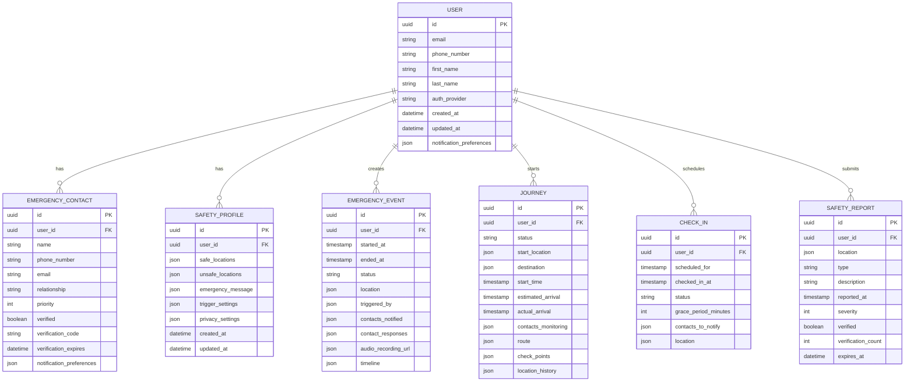

# Shelther 🛡️

<div align="center">
  
  
  [](LICENSE)
  [](VERSION)
  [](https://reactnative.dev/)
  [](https://www.typescriptlang.org/)
  [](https://redux.js.org/)
  [](https://firebase.google.com/)
  
  <h3>Personal safety, simplified — Intuitive protection that fits naturally into your life</h3>
</div>

## 📋 Table of Contents

- [Introduction](#-introduction)
- [Core Features](#-core-features)
- [User Experience](#-user-experience)
- [System Architecture](#-system-architecture)
- [User Flows](#-user-flows)
- [Technical Stack](#-technical-stack)
- [Data Models](#-data-models)
- [API Reference](#-api-reference)
- [Getting Started](#-getting-started)
- [Development Guide](#-development-guide)
- [Deployment](#-deployment)
- [Privacy & Security](#-privacy--security)
- [Contributing](#-contributing)
- [License](#-license)
- [Support](#-support)

## 🌟 Introduction

Shelther redefines personal safety for a world that's simultaneously more connected and more unpredictable than ever before. We've built more than just an app—we've created a discreet digital companion that transforms your smartphone into a powerful safety ecosystem.

## Why Shelther? 🤔

In moments of uncertainty, technology should empower, not complicate. Yet the safety solutions landscape remains surprisingly flawed:

- **🔍 Anxiety Engines:** Most safety apps inadvertently create a perpetual state of alarm, turning every notification into a moment of panic
  
- **🔧 Paralysis by Complexity:** Critical features buried behind multiple taps become unusable precisely when your attention is divided and stress is highest
  
- **🔋 Gone When Needed Most:** Battery-hungry monitoring leaves you vulnerable exactly when protection matters most
  
- **🔒 Trading Privacy for Safety:** Excessive data collection creates an uncomfortable choice between personal security and digital privacy

Shelther breaks this pattern with intelligent design that anticipates real-world scenarios. Our technology stays vigilant in the background, activates instantly when needed, and provides meaningful protection without compromising your digital autonomy. 

It's not about constant vigilance—it's about having confidence that help is available at exactly the right moment, through an interface so intuitive you can use it instinctively, even under pressure.

## ✨ Core Features

### 🔑 Express Login

Biometric and PIN authentication with emergency bypass for quick access.

```typescript
// Example: Emergency bypass authentication
interface EmergencyAccessRequest {
  deviceId: string;
  emergencyToken?: string;
  userIdentifier?: string;
}

const getEmergencyAccess = async (
  request: EmergencyAccessRequest
): Promise<EmergencyAccessResponse> => {
  // Verify device is registered
  const deviceRegistration = await getDeviceRegistration(request.deviceId);
  
  if (!deviceRegistration) {
    throw new Error('Device not registered');
  }
  
  // If emergency token exists and is valid, use it
  if (request.emergencyToken) {
    const tokenValid = await validateEmergencyToken(request.emergencyToken);
    
    if (tokenValid) {
      return generateLimitedAccessToken(deviceRegistration.userId);
    }
  }
  
  // Otherwise attempt to identify user and issue emergency token
  if (request.userIdentifier) {
    const userId = await getUserIdByIdentifier(request.userIdentifier);
    
    if (userId) {
      const emergencyToken = await createEmergencyToken(userId, deviceRegistration.id);
      return {
        emergencyToken,
        expiresIn: 3600, // 1 hour
        capabilities: ['location_sharing', 'emergency_alert', 'contact_notification']
      };
    }
  }
  
  throw new Error('Unable to authenticate for emergency access');
};
```

### 📱 App Widget

Customizable home screen widget for accessing safety features without unlocking your phone.

**Key Capabilities:**
- 🔘 One-tap safety toggles
- 📍 Real-time status display
- 🔄 Discreet mode option
- ⚡ Ultra-efficient battery usage
- 📲 Works without opening app

### ⚠️ Safety Alerts

Location-aware notifications about potentially unsafe areas based on community reports and local data.

```typescript
// Example: Safety scoring algorithm
interface LocationSafetyScore {
  score: number; // 0-100, higher is safer
  factors: {
    factor: string;
    impact: number;
    description: string;
  }[];
  recommendations: string[];
}

const calculateLocationSafety = async (
  latitude: number,
  longitude: number,
  timeOfDay: string,
  userProfile: UserProfile
): Promise<LocationSafetyScore> => {
  // Get data points around location
  const crimeData = await fetchNearbyIncidents(latitude, longitude, 500);
  const communityReports = await fetchCommunityReports(latitude, longitude, 500);
  const environmentalFactors = await assessEnvironmentalSafety(latitude, longitude, timeOfDay);
  
  // Calculate base safety score
  let safetyScore = 100;
  
  // Adjust for crime data
  const crimeImpact = calculateCrimeImpact(crimeData, timeOfDay);
  safetyScore -= crimeImpact.impact;
  
  // Adjust for community reports
  const reportImpact = calculateReportImpact(communityReports, timeOfDay);
  safetyScore -= reportImpact.impact;
  
  // Adjust for environmental factors (lighting, isolation, etc)
  const environmentImpact = calculateEnvironmentImpact(environmentalFactors, timeOfDay);
  safetyScore -= environmentImpact.impact;
  
  // Personal safety adjustments based on user profile
  const personalAdjustment = calculatePersonalSafetyFactors(userProfile);
  safetyScore = adjustScoreForPersonalFactors(safetyScore, personalAdjustment);
  
  // Generate safety recommendations
  const recommendations = generateSafetyRecommendations(
    safetyScore,
    [crimeImpact, reportImpact, environmentImpact],
    userProfile
  );
  
  return {
    score: Math.max(0, Math.min(100, safetyScore)),
    factors: [crimeImpact, reportImpact, environmentImpact],
    recommendations
  };
};
```

### 👪 Circle of 3

Designate trusted contacts who receive escalating alerts if you don't check in or trigger an emergency.

### 👆 Customizable Triggers

Multiple ways to activate help through shake patterns, button sequences, or other discreet methods.

### 🧠 AI Insights & Education Hub

Personalized safety resources and education materials customized to your habits and environment.

## 💻 User Experience

Shelther delivers a modern, intuitive interface designed for clarity during stressful situations.


### UI Design Principles

- **Clarity First**: Simple, unambiguous interfaces for stressful situations
- **Progressive Disclosure**: Show only what's needed, when it's needed
- **Touch-Optimized**: Large targets for use during movement or stress
- **Color Psychology**: Purposeful use of color to convey status and urgency
- **Cognitive Load**: Minimized decision points during emergencies

### Key Screens

#### Home Screen
The central command center with safety status and quick actions.

#### Emergency Screen
Activated during alerts with simple controls and status information.

#### Circle Management
Interface for adding and managing trusted contacts.

#### Journey Monitoring
Real-time tracking and sharing for specific journeys.

## 🏗️ System Architecture

Shelther follows a modern, scalable architecture optimized for reliability and performance.


### Client Architecture

The mobile application follows a clean architecture approach:


## 👤 User Flows

### Emergency Activation Flow


### Journey Monitoring Flow


### Check-In Flow


## 🛠️ Technical Stack

### Mobile Application
- **React Native**: Cross-platform framework
- **TypeScript**: Type-safe JavaScript
- **Redux Toolkit**: State management
- **Redux Persist**: Offline data persistence
- **React Navigation**: Navigation library
- **React Native Maps**: Mapping functionality
- **React Native Geolocation**: Location services
- **React Native Sensors**: Sensor access for triggers
- **React Native Push Notification**: Notifications

### Backend Services
- **Node.js**: Server runtime
- **Express**: Web framework
- **Firebase**: Auth, Cloud Functions, Realtime Database
- **MongoDB**: Document database for structured data
- **Redis**: Caching and real-time pub/sub
- **Socket.io**: Real-time communications

### DevOps & Infrastructure
- **GitHub Actions**: CI/CD
- **Docker**: Containerization
- **AWS/Google Cloud**: Cloud infrastructure
- **Terraform**: Infrastructure as code
- **ELK Stack**: Logging and monitoring

### Security & Compliance
- **Auth0/Firebase Auth**: Authentication
- **JWT**: Token-based authorization
- **Encryption**: End-to-end for sensitive data
- **OWASP**: Security best practices
- **GDPR Compliance**: Privacy by design

## 🗄️ Data Models



## 📡 API Reference

Shelther provides a comprehensive API for its services.

### Authentication

```typescript
/**
 * User authentication
 * POST /api/auth/login
 */
interface LoginRequest {
  email: string;
  password: string;
}

interface LoginResponse {
  token: string;
  user: {
    id: string;
    email: string;
    name: string;
  };
}
```

### Safety Services

| Endpoint | Method | Description |
|----------|--------|-------------|
| `/api/safety/status` | GET | Get current safety status |
| `/api/safety/alerts` | GET | Get active safety alerts |
| `/api/safety/route/:id/score` | GET | Calculate safety score for route |
| `/api/safety/location/score` | POST | Calculate safety score for location |
| `/api/safety/reports` | POST | Submit safety report |

### Emergency Services

| Endpoint | Method | Description |
|----------|--------|-------------|
| `/api/emergency/trigger` | POST | Trigger emergency alert |
| `/api/emergency/:id/update` | PUT | Update emergency status |
| `/api/emergency/:id/resolve` | PUT | Resolve emergency |
| `/api/emergency/:id/contacts` | GET | Get emergency contact responses |

### Contact Management

| Endpoint | Method | Description |
|----------|--------|-------------|
| `/api/contacts` | GET | Get all trusted contacts |
| `/api/contacts` | POST | Add trusted contact |
| `/api/contacts/:id` | PUT | Update trusted contact |
| `/api/contacts/:id/verify` | POST | Verify trusted contact |
| `/api/contacts/:id` | DELETE | Remove trusted contact |

Full API documentation is available at the `/api/docs` endpoint when running the development server.

## 🚀 Getting Started

### Prerequisites

- Node.js (v16+)
- npm or yarn
- React Native development environment
- iOS: XCode & CocoaPods
- Android: Android Studio & SDK
- Firebase account
- Google Maps API key

### Installation

```bash
# Clone the repository
git clone https://github.com/shelther/shelther-app.git
cd shelther-app

# Install dependencies
npm install
# or
yarn install

# Install iOS dependencies
cd ios && pod install && cd ..

# Set up environment variables
cp .env.example .env
# Edit .env with your API keys and configuration

# Run development server for iOS
npm run ios
# or
yarn ios

# Run development server for Android
npm run android
# or
yarn android
```

### Environment Variables

| Variable | Description | Required |
|----------|-------------|----------|
| `GOOGLE_MAPS_API_KEY` | Google Maps API key | Yes |
| `FIREBASE_API_KEY` | Firebase API key | Yes |
| `FIREBASE_AUTH_DOMAIN` | Firebase auth domain | Yes |
| `FIREBASE_PROJECT_ID` | Firebase project ID | Yes |
| `FIREBASE_STORAGE_BUCKET` | Firebase storage bucket | Yes |
| `FIREBASE_MESSAGING_SENDER_ID` | Firebase messaging sender ID | Yes |
| `FIREBASE_APP_ID` | Firebase app ID | Yes |
| `API_BASE_URL` | Base URL for backend API | Yes |

## 💻 Development Guide

### Project Structure

```
shelther-app/
├── android/                # Android native code
├── ios/                    # iOS native code
├── src/
│   ├── assets/             # Images, fonts, etc.
│   ├── components/         # React components
│   │   ├── ui/             # Base UI components
│   │   ├── features/       # Feature-specific components
│   │   └── screens/        # Screen components
│   ├── config/             # Configuration files
│   ├── hooks/              # Custom React hooks
│   ├── navigation/         # Navigation config
│   ├── redux/              # Redux state management
│   │   ├── slices/         # Redux slices
│   │   ├── store.ts        # Redux store
│   │   └── selectors.ts    # Redux selectors
│   ├── services/           # API services
│   ├── types/              # TypeScript types
│   └── utils/              # Utility functions
├── __tests__/              # Tests
├── .env.example            # Example environment variables
└── package.json            # Dependencies and scripts
```

### Component Example

```tsx
// src/components/features/emergency/EmergencyButton.tsx
import React, { useState, useEffect } from 'react';
import { View, Text, StyleSheet, Animated, Easing, TouchableWithoutFeedback } from 'react-native';
import { useDispatch } from 'react-redux';
import { triggerEmergency } from '@/redux/slices/emergencySlice';
import { useLocation } from '@/hooks/useLocation';
import { vibrate } from '@/utils/haptics';
import { useSafetyStatus } from '@/hooks/useSafetyStatus';

interface EmergencyButtonProps {
  size?: number;
  holdTime?: number;
  onActivationStart?: () => void;
  onActivationComplete?: () => void;
  onActivationCancel?: () => void;
}

export const EmergencyButton: React.FC<EmergencyButtonProps> = ({
  size = 120,
  holdTime = 3000,
  onActivationStart,
  onActivationComplete,
  onActivationCancel
}) => {
  const dispatch = useDispatch();
  const { getCurrentLocation } = useLocation();
  const { safetyStatus } = useSafetyStatus();
  
  const [isPressed, setIsPressed] = useState(false);
  const [progress, setProgress] = useState(0);
  
  const pulseAnim = new Animated.Value(1);
  const progressAnim = new Animated.Value(0);
  
  // Set up pulse animation
  useEffect(() => {
    Animated.loop(
      Animated.sequence([
        Animated.timing(pulseAnim, {
          toValue: 1.1,
          duration: 1000,
          easing: Easing.inOut(Easing.ease),
          useNativeDriver: true
        }),
        Animated.timing(pulseAnim, {
          toValue: 1,
          duration: 1000,
          easing: Easing.inOut(Easing.ease),
          useNativeDriver: true
        })
      ])
    ).start();
  }, []);
  
  // Handle button press
  const handlePressIn = () => {
    setIsPressed(true);
    setProgress(0);
    onActivationStart?.();
    vibrate('medium');
    
    progressAnim.setValue(0);
    Animated.timing(progressAnim, {
      toValue: 100,
      duration: holdTime,
      easing: Easing.linear,
      useNativeDriver: false
    }).start(({ finished }) => {
      if (finished && isPressed) {
        handleEmergencyActivation();
      }
    });
    
    progressAnim.addListener(({ value }) => {
      setProgress(value);
    });
  };
  
  // Handle button release
  const handlePressOut = () => {
    progressAnim.stopAnimation();
    progressAnim.removeAllListeners();
    setIsPressed(false);
    
    if (progress < 100) {
      onActivationCancel?.();
    }
  };
  
  // Handle emergency activation
  const handleEmergencyActivation = async () => {
    vibrate('success');
    onActivationComplete?.();
    
    // Get current location
    const location = await getCurrentLocation();
    
    // Trigger emergency in Redux
    dispatch(triggerEmergency({
      location,
      timestamp: new Date().toISOString(),
      triggerMethod: 'button'
    }));
  };
  
  const buttonSize = {
    width: size,
    height: size,
    borderRadius: size / 2
  };
  
  const pulseScale = {
    transform: [{ scale: pulseAnim }]
  };
  
  const progressRotation = progressAnim.interpolate({
    inputRange: [0, 100],
    outputRange: ['0deg', '360deg']
  });
  
  return (
    <View style={styles.container}>
      <Animated.View style={[styles.pulseCircle, buttonSize, pulseScale]}>
        <TouchableWithoutFeedback 
          onPressIn={handlePressIn} 
          onPressOut={handlePressOut}
        >
          <View style={[styles.button, buttonSize]}>
            {isPressed && (
              <Animated.View 
                style={[
                  styles.progressCircle,
                  {
                    width: size - 10,
                    height: size - 10,
                    borderRadius: (size - 10) / 2,
                    transform: [{ rotate: progressRotation }]
                  }
                ]}
              />
            )}
            <View style={styles.buttonContent}>
              <Text style={styles.buttonText}>
                {isPressed ? 'HOLD' : 'SOS'}
              </Text>
              {isPressed && (
                <Text style={styles.buttonSubText}>
                  {Math.floor(progress)}%
                </Text>
              )}
            </View>
          </View>
        </TouchableWithoutFeedback>
      </Animated.View>
      
      <Text style={styles.helpText}>
        {isPressed 
          ? 'Keep holding to activate emergency' 
          : 'Press and hold for emergency'
        }
      </Text>
    </View>
  );
};

const styles = StyleSheet.create({
  container: {
    alignItems: 'center',
    justifyContent: 'center',
  },
  pulseCircle: {
    backgroundColor: 'rgba(255, 90, 90, 0.2)',
    alignItems: 'center',
    justifyContent: 'center',
  },
  button: {
    backgroundColor: '#FF5A5A',
    alignItems: 'center',
    justifyContent: 'center',
    elevation: 5,
    shadowColor: '#000',
    shadowOffset: { width: 0, height: 2 },
    shadowOpacity: 0.3,
    shadowRadius: 4,
  },
  progressCircle: {
    position: 'absolute',
    borderWidth: 3,
    borderColor: 'white',
    borderTopColor: 'transparent',
    borderRightColor: 'transparent',
  },
  buttonContent: {
    alignItems: 'center',
    justifyContent: 'center',
  },
  buttonText: {
    color: 'white',
    fontSize: 24,
    fontWeight: 'bold',
  },
  buttonSubText: {
    color: 'white',
    fontSize: 14,
    marginTop: 2,
  },
  helpText: {
    marginTop: 12,
    fontSize: 14,
    color: '#484848',
    fontWeight: '500',
  }
});
```

## 🚢 Deployment

### iOS Deployment

```bash
# Build iOS production app
cd ios
pod install
cd ..
npm run build:ios
```

App Store submission process:
1. Archive app through XCode
2. Use App Store Connect to submit
3. Complete App Review information

### Android Deployment

```bash
# Generate Android release bundle
cd android
./gradlew bundleRelease
# Or for APK
./gradlew assembleRelease
```

Google Play submission process:
1. Create release in Google Play Console
2. Upload AAB file
3. Complete store listing and review information

## 🔒 Privacy & Security

Shelther is built with privacy and security as core principles:

### Data Privacy
- Minimal data collection policy
- User control over all shared data
- Automatic purging of sensitive information
- No third-party analytics or trackers

### Security Measures
- End-to-end encryption for all sensitive data
- Zero-knowledge design where possible
- Secure local storage with encryption
- Regular security audits and penetration testing

### Compliance
- GDPR compliant by design
- CCPA ready
- Transparent data practices
- Clear, understandable privacy policy

## 👥 Contributing

We welcome contributions to Shelther! Please follow these steps:

1. Fork the repository
2. Create your feature branch (`git checkout -b feature/amazing-feature`)
3. Commit your changes (`git commit -m 'feat: add amazing feature'`)
4. Push to the branch (`git push origin feature/amazing-feature`)
5. Open a Pull Request

Please follow our coding standards and include appropriate tests.

## 📄 License

This project is licensed under the MIT License - see the [LICENSE](LICENSE) file for details.

## 🆘 Support

For support, please contact:
- Email: support@shelther.app
- Documentation: [docs.shelther.app](https://docs.shelther.app)
- Issues: Create an issue in this repository

---

<div align="center">
  <p>Built with ❤️ by the Shelther Team</p>
  <p>
    <a href="https://twitter.com/sheltherapp">Twitter</a> •
    <a href="https://linkedin.com/company/shelther">LinkedIn</a> •
    <a href="https://shelther.app">Website</a>
  </p>
</div>